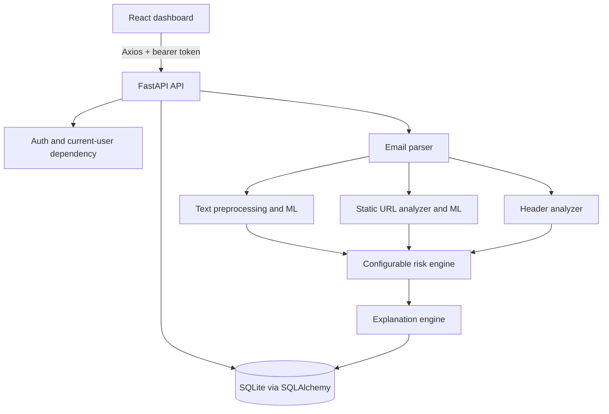

# PhishZero Architecture

## System overview

PhishZero is a local-first web application. The React frontend sends validated user actions to a FastAPI backend. The backend authenticates the user, parses untrusted email content as data, runs passive analysis components, combines their signals in the risk engine, stores owned results in SQLite, and returns an evidence-based explanation.

## Frontend

The frontend uses React Router for public and protected routes:

- `/login` and `/register` — authentication
- `/dashboard` — live history summary, classification distribution, and risk statistics
- `/analyze` — manual email fields, raw headers, and safe `.eml` parsing
- `/results/:id` — classification, scores, threats, URLs, explanations, and actions
- `/history` — owned analysis history with filtering
- `/settings` — current account and security-boundary information

Axios adds the bearer token from the existing browser session storage strategy and translates backend errors into user-facing messages. React text rendering is used for untrusted email-derived values; email HTML is not inserted as active markup.

## Backend layers

- `app/main.py` — FastAPI application, CORS, request limits, rate limiting, health endpoint, and generic error handling.
- `app/api/` — authentication, email ingestion, and analysis routes.
- `app/schemas/` — Pydantic validation and response contracts.
- `app/core/` — environment configuration, password/JWT helpers, and rate limiter.
- `app/services/email_parser.py` — manual and RFC email parsing with metadata-only attachments.
- `app/services/url_analyzer.py` — URL-string-only static feature extraction.
- `app/services/header_analyzer.py` — passive header and SPF/DKIM/DMARC analysis.
- `app/services/risk_engine.py` — centralized weighted score and configurable thresholds.
- `app/services/explanation_engine.py` — explanations generated only from actual indicators.
- `app/db/` — SQLAlchemy models, session management, and SQLite foreign-key enforcement.
- `app/ml/` — preprocessing, training, prediction, evaluation, and artifact conventions.

## Analysis flow

1. The authenticated user submits structured fields or an `.eml` upload.
2. Server-side validation checks field sizes, email addresses, headers, content type, and request size.
3. The parser extracts sender, recipients, subject, text, HTML, headers, URLs, and attachment metadata. Attachments are never executed or opened as files.
4. Text, URL, and header components produce scores and indicators. URL analysis does not resolve or visit a URL.
5. The risk engine applies centralized weights and thresholds, tolerating unavailable ML models.
6. The explanation engine maps only detected evidence to reasons and recommended actions.
7. Analysis, URLs, and threat indicators are persisted under the authenticated user’s email record.
8. The response is rendered as escaped text by the frontend.

## Operational boundaries

The application is designed for authorized local or controlled deployments. It does not provide outbound URL fetching, external threat-intelligence integration, email sending, attachment execution, or active infrastructure scanning. Production use requires TLS, a managed secret store, a shared rate limiter, stronger session handling, and an operational database.
